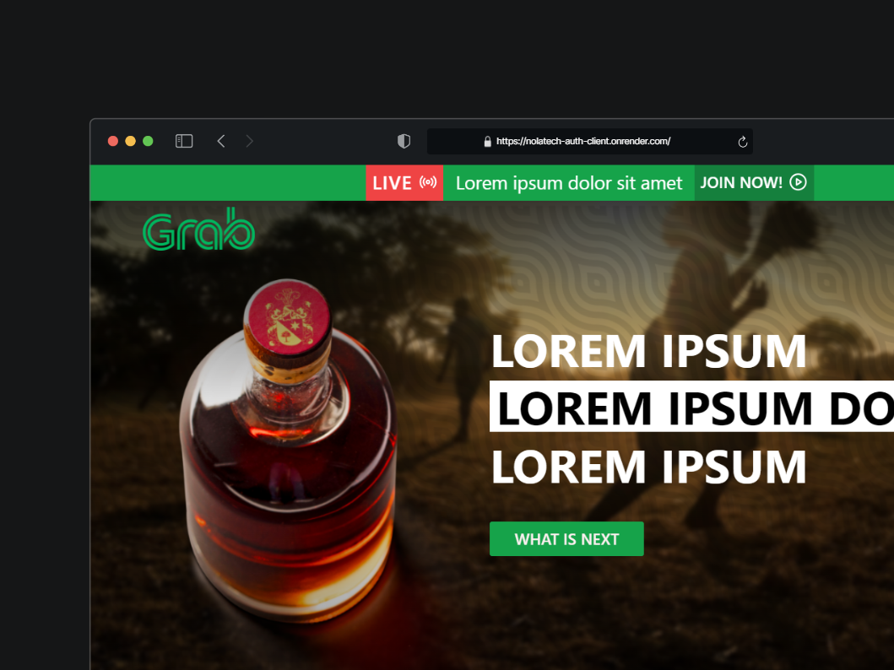

# Repositorio Back de la Prueba Técnica 🚀


El proyecto consiste en un servidor de autenticación que permite a los usuarios registrarse e iniciar sesión, además de contar con un sistema de administración de usuarios.

API REST: [https://nolatech-tech-server.onrender.com/api/v1](https://nolatech-auth-server.herokuapp.com)



## Tecnologías Utilizadas 🛠

Este proyecto hace uso de las siguientes tecnologías y librerías:

- **Node.js**: Entorno de ejecución para JavaScript.
- **Express**: Utilizado para construir el servidor de la aplicación.
- **MongoDB**: Base de datos utilizada para almacenar los datos de los usuarios.
- **Prisma**: ORM utilizado para interactuar con la base de datos.
- **Zod**: Utilizado para validar los datos del formulario.
- **Bcrypt**: Utilizado para encriptar las contraseñas de los usuarios.
- **Jsonwebtoken**: Utilizado para generar tokens de autenticación.
- **Cors**: Middleware para habilitar CORS en el servidor.
- **Dotenv**: Utilizado para cargar variables de entorno desde un archivo `.env`.
- **Morgan**: Middleware para registrar las solicitudes HTTP.
- **Nodemon**: Utilizado para reiniciar automáticamente el servidor al detectar cambios en el código.
- **Jest**: Framework de pruebas para JavaScript.

## Endpoints 🌐

El servidor cuenta con los siguientes endpoints:

### Autenticacion 🚪

- **POST /api/auth/register**: Registra un nuevo usuario.
- **POST /api/auth/login**: Inicia sesión con las credenciales de un usuario.

### Usuarios 👤

- **GET /api/users** Obtiene todos los usuarios registrados, soporta las siguientes query params:
  - **page**: Número de página.
  - **limit**: Número de elementos por página.
  de tal forma que la URL se vería algo así: `/api/users?page=1&limit=10`.
- **GET /api/users/:id**: Obtiene un usuario por su ID.
- **PUT /api/users/:id**: Actualiza un usuario por su ID.
- **DELETE /api/users/:id**: Elimina un usuario por su ID.


## 🚀 Instalación y Uso

Sigue estos pasos para instalar y correr el proyecto:

### Clonar el repositorio

```bash
git clone URL_DEL_REPOSITORIO
```

### Instalar las dependencias

```bash
npm install
```

### Iniciar el proyecto

```bash
npm run dev
```
